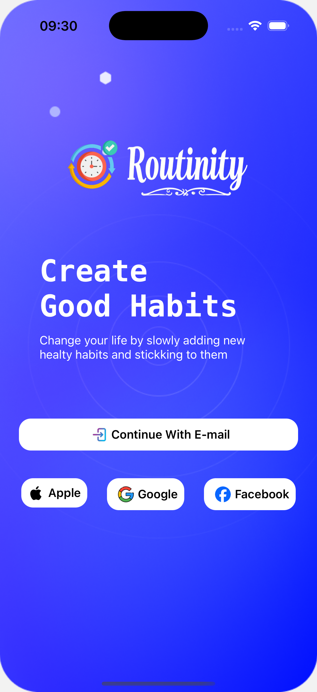
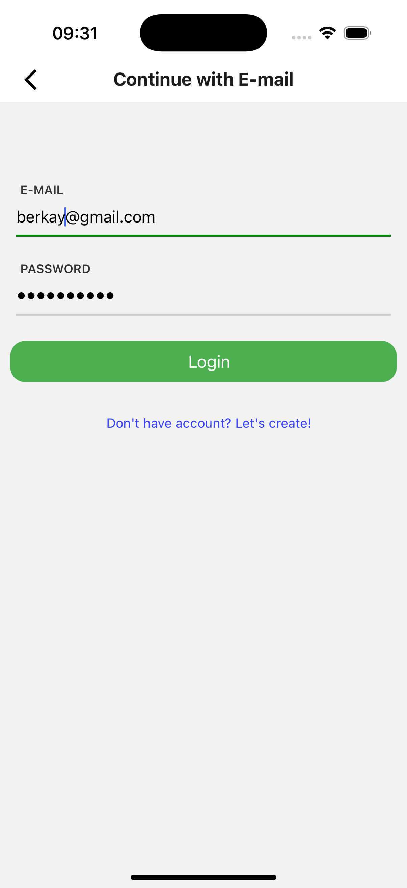
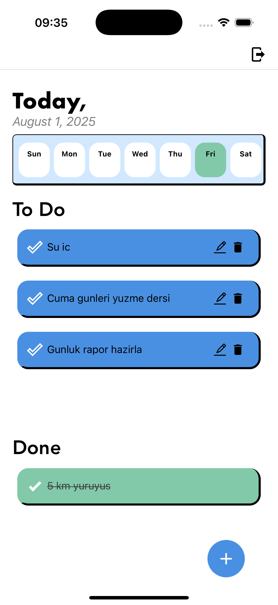

# Routinity
Kullanıcının günlük alışkanlıklarını planlayıp takip etmesini sağlayan mobil uygulama

# 🧠 Habit Tracker App

Bu proje, kullanıcıların haftalık alışkanlıklarını planlamasını ve takip etmesini sağlayan bir mobil uygulamadır. React Native ile geliştirilmiş, Firebase Realtime Database ile veri yönetimi yapılmıştır.

---

## 📱 Uygulama Özellikleri

- ✅ Alışkanlık ekleme 
- 📅 Haftanın günlerine göre alışkanlık atama
- 🔄 Gerçek zamanlı veri güncellemesi (Firebase Realtime Database)
- 🟩 Bugünkü alışkanlıkları gösterme
- ✏️ Alışkanlık düzenleme (Modal içinde)
- ✔️ Tamamlanan alışkanlıkları işaretleme ve ayrı listede gösterme
- 🌗 Tüm özellikler aynı ekranda bölümlendirilerek yerleştirilmiştir
- Gün isimleri üstte yatay scroll ile gösterilir, bugünkü gün vurgulu renktedir

---

## 🛠️ Kullanılan Teknolojiler & Kütüphaneler

- **React Native**
- **Firebase Realtime Database**
- **Firebase Auth** 
- **React Navigation**
- **React Native Modal**
- **UUID** (benzersiz ID üretimi için)
- **UUID** (benzersiz ID üretimi için)
- **`formik` | Form yönetimini kolaylaştırmak için kullanılır**
**`react-native-vector-icons`** | Uygulamada ikon (icon) kullanımı için

- **React Native Vector Icons -> Uygulamada ikon (icon) kullanımı için popüler ve çok geniş bir ikon kütüphanesidir |**
- **react-native-flash-message` | Uygulama içi bilgi, uyarı, hata mesajlarını göstermek için kullanılır. |**
- **Custom Modal ve FloatingButton bileşenleri**

---

